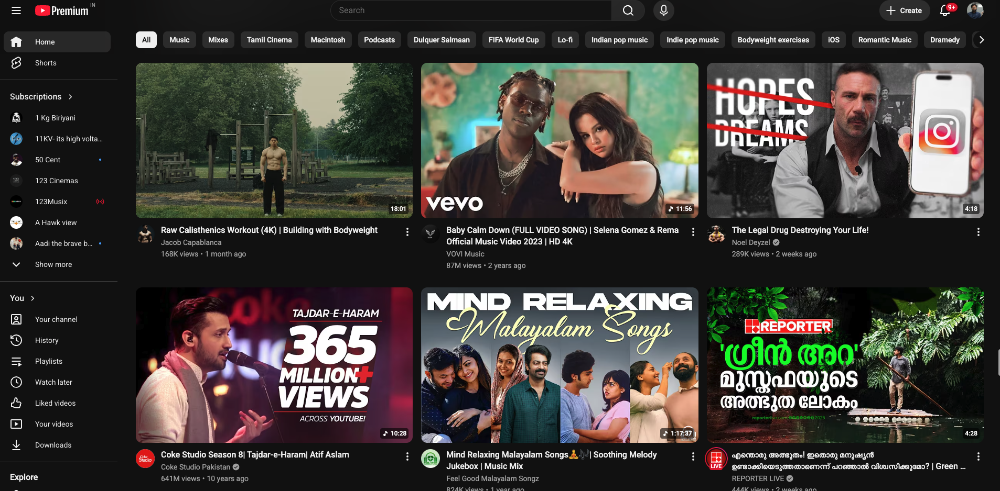

# YouTube Web UI Clone



## 📌 Overview
This project is a responsive, front-end clone of the YouTube web interface. It showcases a clean and modern design with a structured layout, mimicking the core visual elements of YouTube, including the navigation bar, sidebar, and a dynamic video content grid.

## ✨ Features
- **Responsive Layout**: Adapts smoothly to different screen sizes, providing an optimal viewing experience on both desktop and mobile devices.
- **Sidebar Navigation**: Includes a collapsible sidebar with standard YouTube sections (Home, Trending, Subscriptions, Library, etc.).
- **Video Grid**: A clean grid layout for video thumbnails, including author avatars, video titles, and view counts.
- **Header & Search Bar**: A fully styled header featuring a search input, voice search icon, and user profile navigation.
- **Material Icons**: Utilizes Google Material Icons for a sleek, authentic look.

## 🛠️ Tech Stack
- **HTML5**: For semantic structuring of the web pages.
- **CSS3 (Vanilla)**: Custom styling for the layout, transitions, and component designs.
- **Bootstrap 5**: Used for rapid UI development and responsive grid structures (Cards, styling helpers).

## 🚀 Getting Started

### Prerequisites
You only need a modern web browser (Chrome, Firefox, Safari, Edge) to run this project.

### Installation & Execution
1. Clone the repository:
   ```bash
   git clone git@github.com-sahaddev:sahaddev/Youtube-web.git
   ```
2. Navigate to the project directory:
   ```bash
   cd Youtube-web/image
   ```
3. Open `intex.html` in your web browser.

## 📁 Project Structure
- `intex.html`: The main entry point containing the YouTube home page structure.
- `form.html`: Additional page/form layout.
- `youtube.css`: Contains all custom CSS styling for the project.
- `img/` & `img-2/`: Directories containing all the assets, thumbnails, and profile images used in the UI.

## 🤝 Contributing
Contributions, issues, and feature requests are welcome! Feel free to check the [issues page](../../issues).

---
